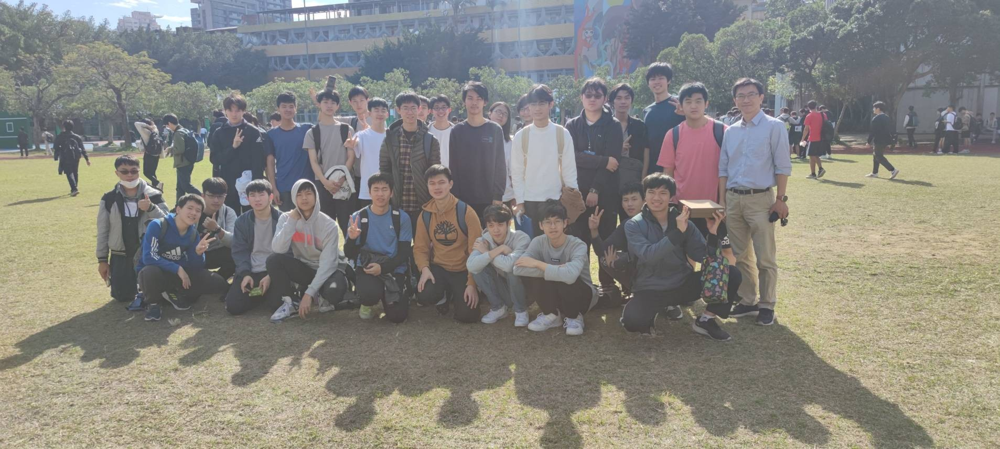

# 臺北市建國高中科學班第14屆成果發表網站

臺北市立建國高級中學科學班第14屆成果發表《Constellation》將於2024年5月20日舉行，而這裡是網站原始碼的儲存庫。
Welcome to the repository for the Jianguo High School Class of Sicence class project presentation. This webpage is designed to showcase our project and provide information about the event. For more detail, please check the English version of this README file. [link](./README_EN.md)

## 訪問網站

訪問網站：[https://constellation-ckcos14th.github.io](https://constellation-ckcos14th.github.io) 

## 內容

- 相關連結🌐
- 團體照 📸
- 音樂MV 🎵
- 地點 📍
- 日期和時間 🗓️⏰
- 框架 🖥️
- 開始 🚀
- 團隊 👥
- 許可證 📃

## 相關連結

[__instagram__](https://www.instagram.com/ckcos14th.constellation/)  [__youtube__](https://www.youtube.com/@constellation_ckcos14)

## 團體照



## 音樂MV

觀看我們專案創作的驚人音樂MV：[音樂MV連結](https://youtu.be/csln2lMUCHU) 🎵🎥
[](https://www.youtube.com/watch?v=csln2lMUCHU)

## 地點

活動將在臺北市建國高中夢紅樓舉行
地址：臺北市中正區南海路56號。🏫🌆

## 日期和時間

專題展示將於以下日期和時間舉行：
- 日期：2024年5月20日（星期一）
- 時間：下午1:00至下午5:00 ⏰

## 框架

此網頁使用Vue.js框架構建。🖥️🔧

## 開始

要在本地運行此網頁，請按照以下步驟操作：

1. 複製檔案：
```bash
git clone https://github.com/constellation-ckcos14th/Constellation-ckcos14th.github.io
```
2. 安裝依賴：
```bash
yarn
```
3. 啟動伺服器：
```bash
yarn dev
```
4. 在瀏覽器中打開`http://localhost:5173/` 以查看網頁。🌐👀

## 開發團隊

這個網站是由上一屆[數資班的網站](https://github.com/ckmsc39th/ckmsc39th.github.io)改的，目前由王以安([ianwang1204@gmail.com](mailto:ianwang1204@gmail.com) 📧)、施竣耀維護。

## 許可證

本專案使用MIT許可證。詳細信息請參閱`LICENSE`文件。📃